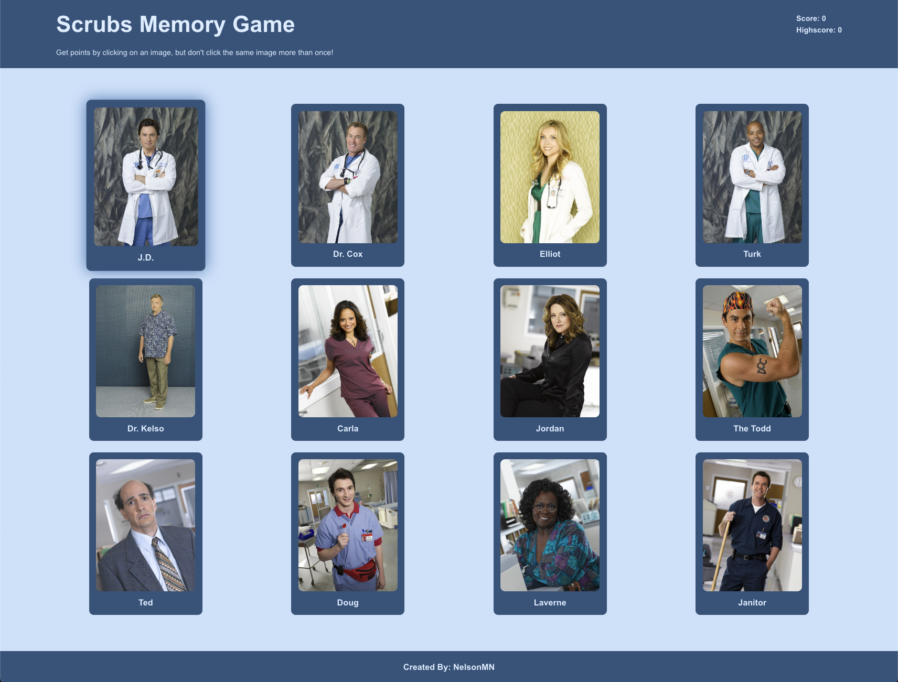

## Resume Architect

This is a Scrubs themed memory game in which users are asked to click a card containing a character. You can gain points by clicking on the cards that you have not already clicked. The maximum highscore possible is 12.

This project uses functional components and the useState / useEffect hooks. The randomization of the cards uses the [Durstenfeld Shuffle](https://en.wikipedia.org/wiki/Fisher%E2%80%93Yates_shuffle#The_modern_algorithm) Algorithm.

## Screenshot

### Built With

* [React.js](https://reactjs.org/)
* [Create React App](https://create-react-app.dev/)
* [JavaScript](https://www.javascript.com/)

## Contact

Nelson M - https://www.linkedin.com/in/nelsonmieszkalski/

Project Link: [https://nelsonmn.github.io/memory-game/](https://nelsonmn.github.io/memory-game/)